# VaultAssist - Personal Google Workspace MCP Server


A **Model Context Protocol (MCP) server** that provides comprehensive Google Workspace integration for your personal AI assistant with vault-level security. 

Built with **Next.js**, **TypeScript**, **Better Auth**, and **Vercel's MCP SDK**, this server enables natural language control over Gmail, Google Drive, Calendar, Sheets, Slides, and Tasks through secure OAuth 2.1 authentication with advanced session management and graph database integration.

## Overview

VaultAssist acts as a secure bridge between AI assistants and Google Workspace services, enabling seamless automation and data access through a vault-secured, authenticated API. The server uses **Better Auth** for robust user session management, **PostgreSQL** for persistent data storage, and **Graph DBs** for intelligent relationship mapping across your personal data ecosystem.
VaultAssist acts as a secure bridge between AI assistants and Google Workspace services, enabling seamless automation and data access through a vault-secured, authenticated API. The server supports multiple users, with each user's data, sessions, and Google Workspace access fully isolated. **Better Auth** provides robust user session management, **PostgreSQL** ensures persistent, per-user data storage, and **Graph DBs** enable intelligent, user-specific relationship mapping across your personal data ecosystem.

```mermaid
graph TB
    subgraph "Client Layer"
        VSCode[VS Code MCP Client]
        Other[Other MCP Clients]
    end

    subgraph "VaultAssist MCP Server (Next.js)"
        Auth[Better Auth<br/>OAuth 2.1 + MCP Plugin]
        Router[MCP Handler<br/>Vercel SDK + Dynamic Routes]
        
        subgraph "Tool Registry"
            Gmail[Gmail Tools]
            Drive[Drive Tools]
            Docs[Docs Tools]
            Calendar[Calendar Tools]
            Sheets[Sheets Tools]
            Slides[Slides Tools]
            Tasks[Tasks Tools]
            Memory[Memory Tools]
            Sequential[Sequential Thinking]
        end
        
        subgraph "Core Services"
            OAuth[Google OAuth Client]
            Schema[Zod Validation]
            DB[Database Layer]
            GraphDB[Graph Database<br/>Relationships & Context]
            SessionMgmt[Advanced Session<br/>Management]
        end
    end

    subgraph "Google APIs"
        GmailAPI[Gmail API]
        DriveAPI[Drive API]
        DocsAPI[Docs API]
        CalendarAPI[Calendar API]
        SheetsAPI[Sheets API]
        SlidesAPI[Slides API]
        TasksAPI[Tasks API]
    end

    subgraph "Infrastructure"
        PostgresDB[(PostgreSQL Database<br/>User Data & Sessions)]
        GraphStore[(Graph Database<br/>Relationships & Memory)]
        GoogleCloud[Google Cloud Console<br/>OAuth 2.1 Credentials]
        VercelSDK[Vercel MCP SDK<br/>& Libraries]
    end

    %% Client connections
    VSCode --> Router
    Other --> Router

    %% Authentication flow
    Router --> Auth
    Auth --> GoogleCloud
    Auth --> DB
    Auth --> SessionMgmt
    DB --> PostgresDB
    SessionMgmt --> GraphStore

    %% Tool registration and execution
    Router --> Gmail
    Router --> Drive
    Router --> Docs
    Router --> Calendar
    Router --> Sheets
    Router --> Slides
    Router --> Tasks
    Router --> Memory
    Router --> Sequential

    %% Service layer with MCP SDK integration
    Gmail --> OAuth
    Drive --> OAuth
    Docs --> OAuth
    Calendar --> OAuth
    Sheets --> OAuth
    Slides --> OAuth
    Tasks --> OAuth
    Memory --> GraphDB
    Sequential --> GraphDB

    %% External API calls
    OAuth --> GmailAPI
    OAuth --> DriveAPI
    OAuth --> DocsAPI
    OAuth --> CalendarAPI
    OAuth --> SheetsAPI
    OAuth --> SlidesAPI
    OAuth --> TasksAPI

    %% Data validation and MCP SDK
    Gmail --> Schema
    Drive --> Schema
    Docs --> Schema
    Calendar --> Schema
    Sheets --> Schema
    Slides --> Schema
    Tasks --> Schema
    Memory --> Schema
    Sequential --> Schema
    
    %% MCP SDK Integration
    Router --> VercelSDK
    Schema --> VercelSDK
    Auth --> VercelSDK

    %% Graph database relationships
    GraphDB --> PostgresDB
    GraphDB --> GraphStore

    %% Styling
    classDef clientNodes fill:#e1f5fe,stroke:#01579b,stroke-width:2px,color:#000000
    classDef serverNodes fill:#f3e5f5,stroke:#4a148c,stroke-width:2px,color:#000000
    classDef apiNodes fill:#fff3e0,stroke:#e65100,stroke-width:2px,color:#000000
    classDef infraNodes fill:#e8f5e8,stroke:#2e7d32,stroke-width:2px,color:#000000

    class VSCode,Other clientNodes
    class Auth,Router,Gmail,Drive,Docs,Calendar,Sheets,Slides,Tasks,Memory,Sequential,OAuth,Schema,DB,GraphDB,SessionMgmt serverNodes
    class GmailAPI,DriveAPI,DocsAPI,CalendarAPI,SheetsAPI,SlidesAPI,TasksAPI apiNodes
    class PostgresDB,GraphStore,GoogleCloud,VercelSDK infraNodes
```



## Features

### **Secure**
- OAuth 2.1 authentication with encrypted token storage
- Secure session management and automatic token refresh
- Input validation with Zod schemas and CORS protection
- Environment-based secrets management
- Multi-user isolation: Each user has a fully isolated workspace, with strict separation of sessions, tokens, and data. No cross-user access is possible. All Google Workspace API calls and memory graphs are partitioned per user for maximum privacy.


### **Google Workspace Coverage**
- **Gmail**: Full email management with search, labels, and batch operations
- **Drive**: File operations with Office format support and URL imports
- **Docs**: Create, edit, search, and batch update Google Docs with advanced content manipulation
- **Calendar**: Event management with Google Meet and attachments
- **Sheets**: Spreadsheet operations with flexible data I/O
- **Slides**: Presentation management with batch updates
- **Tasks**: Complete task and task list management with hierarchy

### **Intelligent Context Management**
- Graph database integration for relationship mapping across personal data
- Memory persistence for long-term context retention
- Sequential thinking patterns for complex task management
- Cross-platform data correlation and insights

### **Developer Experience**
- Built on Vercel MCP SDK for optimal performance and reliability
- Full TypeScript implementation with Zod validation
- Modular architecture with clean separation of concerns
- PostgreSQL database with Drizzle ORM and graph database integration
- Support for multiple MCP transport methods such as Streamable HTTP & SSE (deprecated)

## Architecture

### **Multi-User Architecture & Isolated Access**

VaultAssist is designed for secure, multi-user operation. Each user authenticates via OAuth 2.1 and is assigned a unique, encrypted session. All Google Workspace API calls are performed strictly on behalf of the authenticated user, ensuring that:

- **Data Isolation**: User data, tokens, and memory graphs are partitioned and encrypted per user. No user can access another user's data or sessions.
- **Session Security**: Sessions are managed with Better Auth, providing advanced session isolation and automatic token refresh for each user.
- **Per-User API Access**: All Google API operations are scoped to the authenticated user's account, with no shared credentials.
- **Database & Graph Partitioning**: PostgreSQL and graph database entries are keyed and isolated per user, preventing cross-user data leakage.

This architecture enables VaultAssist to safely serve multiple users in parallel, with strong guarantees of privacy and access control.

### **Project Structure**
```
mcp-server/
├── src/
│   ├── app/
│   │   ├── api/[transport]/     # MCP endpoint with tool registry
│   │   ├── auth/                # Authentication pages
│   │   └── dashboard/           # User dashboard
│   ├── lib/
│   │   ├── auth.ts              # Better Auth configuration
│   │   ├── db/                  # Database schema & operations
│   │   └── toolset/google/      # Google API implementations
│   └── components/              # UI components
├── drizzle/                     # Database migrations
└── package.json
```

## Demo

https://github.com/user-attachments/assets/d0bf7f21-8044-4308-a029-1b8c13c439c9

## Prerequisites

- **Node v22+** and package manager (bun, npm etc.)
- **PostgreSQL database** (local or cloud)
- **Neo4j database** (Aura or self-hosted)
- **Redis instance** (Upstash or self-hosted)
- **Google Cloud Project** with OAuth 2.1 credentials
- **MCP-compatible client** (VS Code, etc.)
- **Docker**

## Setup & Installation

### 1. **Clone and Install Dependencies**

```bash
git clone https://github.com/3xCaffeine/mcp-server.git
cd mcp-server
bun install # or npm install, pnpm install, yarn install
```

### 2. **Database Setup**

Set up your PostgreSQL database and configure environment variables:

```bash
# Copy environment template
cp .env.example .env
```

### 3. **Google Cloud Console Setup**

1. **Create a Google Cloud Project**
2. **Enable APIs**: 
   - Gmail API
   - Google Drive API
   - Google Calendar API
   - Google Sheets API
   - Google Slides API
   - Google Tasks API
3. **Create OAuth 2.1 Credentials**:
   - Go to **APIs & Services → Credentials**
   - Click **Create Credentials → OAuth Client ID**
   - Choose **Web Application**
   - Add authorized redirect URIs:
     - `http://localhost:3000/api/auth/callback/google`
   - Download credentials and add to `.env`

### 4. **Database Migration**

```bash
# Generate and run migrations
bun run drizzle:generate
bun run drizzle:migrate

# Optional: Open Drizzle Studio to inspect database
bun run drizzle:studio
```

### 5. **Development Server**

```bash
# Start development server
bun dev
```

Visit `http://localhost:3000/dashboard` to access the web interface.

## Deployment Steps

1. Check the Caddy config and start the services with Docker Compose.
```bash
cd mcp-server/deployment/
docker compose up -d
```

## MCP Client Configuration

Open up the VS Code Command Palette > MCP:Open User Configuration and paste the below into `mcp.json` config.

### **VS Code MCP Client**

```json
{
	"servers": {
		"google-workspace": {
			"url": "https://mcp.rycerz.es:3000/api/mcp",
			"type": "http"
		}
	},
	"inputs": []
}
```

## Authentication Flow

1. **Initial Setup**: User visits `/auth` and signs in with Google
2. **OAuth Flow**: Better Auth handles Google OAuth 2.1 flow with enhanced security
3. **Token Storage**: Access/refresh tokens stored securely in PostgreSQL with encryption
4. **MCP Session**: Better Auth MCP plugin manages session tokens with vault-level security
5. **API Access**: Each tool call uses stored tokens for Google API access
6. **Graph Integration**: User interactions are mapped to graph database for context management

## Available Tools

### **Gmail Tools**
| Tool | Description |
|------|-------------|
| `search_gmail_emails` | Search emails using Gmail query syntax |
| `read_gmail_email` | Read full email content by message ID |
| `send_gmail_email` | Send emails with attachments and formatting |
| `draft_gmail_email` | Create email drafts |
| `modify_gmail_email` | Add/remove labels from emails |
| `delete_gmail_email` | Delete emails permanently |
| `list_gmail_labels` | List all Gmail labels |
| `create_gmail_label` | Create custom labels |
| `update_gmail_label` | Modify existing labels |
| `delete_gmail_label` | Delete custom labels |
| `get_or_create_gmail_label` | Get existing or create new label |
| `batch_modify_gmail_emails` | Bulk label operations |
| `batch_delete_gmail_emails` | Bulk email deletion |

### **Google Drive Tools**
| Tool | Description |
|------|-------------|
| `search_drive_files` | Search files using Drive query syntax |
| `get_drive_file_content` | Read file content (supports Office formats) |
| `list_drive_items` | List files and folders in directories |
| `create_drive_file` | Create files with content or from URLs |

### **Google Docs Tools**
| Tool | Description |
|------|-------------|
| `search_docs` | Search for Google Docs by name using Drive API |
| `get_doc_content` | Retrieve content of a Google Doc or Drive file (.docx, etc.) |
| `list_docs_in_folder` | List Google Docs within a specific Drive folder |
| `create_doc` | Create a new Google Doc and optionally insert initial content |
| `modify_doc_text` | Modify text in a Google Doc - insert/replace text and/or apply formatting |
| `find_and_replace_doc` | Find and replace text throughout a Google Doc |
| `insert_doc_elements` | Insert structural elements like tables, lists, or page breaks |
| `insert_doc_image` | Insert an image into a Google Doc from Drive or URL |
| `update_doc_headers_footers` | Update headers or footers in a Google Doc |
| `batch_update_doc` | Execute multiple document operations in a single atomic batch update |
| `inspect_doc_structure` | Find safe insertion points and understand document structure |
| `create_table_with_data` | Create a table and populate it with data |
| `debug_table_structure` | Debug table layout and cell positions |

### **Google Calendar Tools**
| Tool | Description |
|------|-------------|
| `list_calendars` | List accessible calendars |
| `get_events` | Retrieve events with filtering |
| `create_event` | Create events with Google Meet and attachments |
| `modify_event` | Update existing events |
| `delete_event` | Remove events |
| `get_event` | Get detailed event information |

### **Google Sheets Tools**
| Tool | Description |
|------|-------------|
| `list_spreadsheets` | List accessible spreadsheets |
| `get_spreadsheet_info` | Get spreadsheet metadata |
| `read_sheet_values` | Read cell ranges |
| `modify_sheet_values` | Write/update/clear cells |
| `create_spreadsheet` | Create new spreadsheets |
| `create_sheet` | Add sheets to existing files |

### **Google Slides Tools**
| Tool | Description |
|------|-------------|
| `create_presentation` | Create new presentations |
| `get_presentation` | Get presentation details |
| `batch_update_presentation` | Apply multiple updates |
| `get_page` | Get slide information |
| `get_page_thumbnail` | Generate slide thumbnails |

### **Google Tasks Tools**
| Tool | Description |
|------|-------------|
| `list_task_lists` | List all task lists |
| `get_task_list` | Get task list details |
| `create_task_list` | Create new task lists |
| `update_task_list` | Modify task lists |
| `delete_task_list` | Delete task lists |
| `list_tasks` | List tasks with filtering |
| `get_task` | Get task details |
| `create_task` | Create tasks with hierarchy |
| `update_task` | Modify tasks |
| `delete_task` | Remove tasks |
| `move_task` | Reposition tasks |
| `clear_completed_tasks` | Clean up completed tasks |

### **Memory Tools**
| Tool | Description |
|------|-------------|
| `memory_create_entities` | Store new entities in the user's memory graph. |
| `memory_create_relations` | Create relationships between entities. |
| `memory_add_observations` | Add details to existing entities. |
| `memory_delete_entities` | Remove entities and their relationships. |
| `memory_delete_observations` | Remove specific details from entities. |
| `memory_delete_relations` | Remove relationships between entities. |
| `memory_read_graph` | Retrieve the full memory graph. |
| `memory_search_nodes` | Search for nodes by name, type, or content. |
| `memory_open_nodes` | Get details for specific entities. |

### **Sequential Thinking Tools**
| Tool | Description |
|------|-------------|
| `sequentialthinking` | Dynamic, reflective problem-solving. |


## Credits
- [run-llama/mcp-nextjs](https://github.com/run-llama/mcp-nextjs) - Next.js OAuth MCP implementation
- [NapthaAI/http-oauth-mcp-server](https://github.com/NapthaAI/http-oauth-mcp-server) - MCP spec authorization extension
- [GongRzhe/Gmail-MCP-Server](https://github.com/GongRzhe/Gmail-MCP-Server) - Gmail tools 
- [j3k0/mcp-google-workspace](https://github.com/j3k0/mcp-google-workspace) - Gmail & Calendar 
- [taylorwilsdon/google_workspace_mcp](https://github.com/taylorwilsdon/google_workspace_mcp/) - Most of the google services were inspired by this
- [modelcontextprotocol/servers](https://github.com/modelcontextprotocol/servers/) - sequential thinking & knowledge graph based memory
